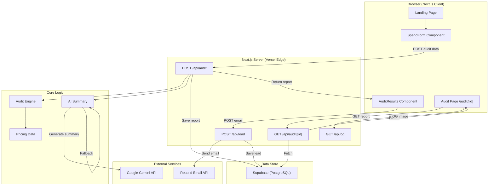

# Architecture

## System Diagram

## Data Flow

1. **User Input** → SpendForm captures tool entries (tool, plan, spend, seats, use case)
2. **Audit Request** → POST /api/audit validates, runs audit engine, generates AI summary
3. **Audit Engine** → Evaluates each tool on 4 dimensions against pricing data, picks highest-savings recommendation
4. **AI Summary** → Sends audit data to Gemini 2.5 Flash; falls back to template on any failure
5. **Storage** → Report saved to Supabase (PostgreSQL) with unique nanoid
6. **Results** → Client renders pivot table, savings banner, AI summary, share URL
7. **Lead Capture** → Optional email submission triggers Resend transactional email
8. **Sharing** → Unique URL `/audit/[id]` with dynamic OG image for social previews

## Why I Chose This Stack

- **Next.js 16 (App Router):** Server-side rendering required for OG tags on shared URLs. API routes eliminate the need for a separate backend. TypeScript-first. Vercel deployment is free and instant.
- **Tailwind CSS v4:** Assignment explicitly allows it. Fastest path to a premium, responsive UI without writing hundreds of custom CSS rules. Consistent design tokens.
- **Supabase (PostgreSQL):** Used for persistent storage of audit results and lead captures. Provides a robust relational database with built-in API capabilities, scaling seamlessly while keeping serverless cold-start times low compared to traditional ORMs.
- **Google Gemini (free tier):** The assignment requires AI-generated summaries. Gemini 2.5 Flash is free, fast, and produces good output. The fallback template ensures the app works without any API key.
- **Vitest:** Fastest test runner for TypeScript. 18 tests covering audit engine logic and pricing data validation.

## Abuse Protection Choice (What + Why)

- **Rate limit on audit creation (`POST /api/audit`)**: in-memory IP-based window (`20 requests / hour`) to block obvious spam bursts while preserving a frictionless UX for real users.
- **Honeypot field on both form submissions** (`POST /api/audit` and `POST /api/lead`): hidden field rejects common bot form-fillers without adding captcha friction.

### Why this approach

- **Low-friction MVP:** hCaptcha would reduce abuse further, but it also hurts conversion and adds setup complexity for a weekend build.
- **Good-enough baseline:** rate limiting handles volume abuse; honeypot handles unsophisticated bots; together they cover the most likely abuse at this stage.
- **Easy hardening path:** if abuse rises, this can evolve to Redis-backed distributed limits + hCaptcha on `/api/lead` only.

## Scaling to 10k audits/day

If the application needed to scale from ~200 audits/day to 10,000 audits/day, the following architectural changes would be required:

1. **Database Connection Pooling:** At 10k requests/day, Vercel edge functions connecting directly to Supabase would quickly exhaust the PostgreSQL connection limit. I would implement PgBouncer (which Supabase provides natively) to handle connection pooling effectively.
2. **Caching AI Summaries:** Currently, every audit hits the Gemini API. At high volume, many users will have identical tech stacks (e.g., 2 devs on Cursor Pro + ChatGPT Plus). I would implement a Redis cache (via Upstash) keyed by a hash of the tool inputs to return pre-generated summaries instantly and drastically cut LLM API costs.
3. **Queue-Based Email Sending:** Triggering the Resend API synchronously during the lead capture request risks timeouts. I would decouple this by publishing an event to a queue (like Vercel KV or Upstash QStash) and having a background worker process the email sending asynchronously.
