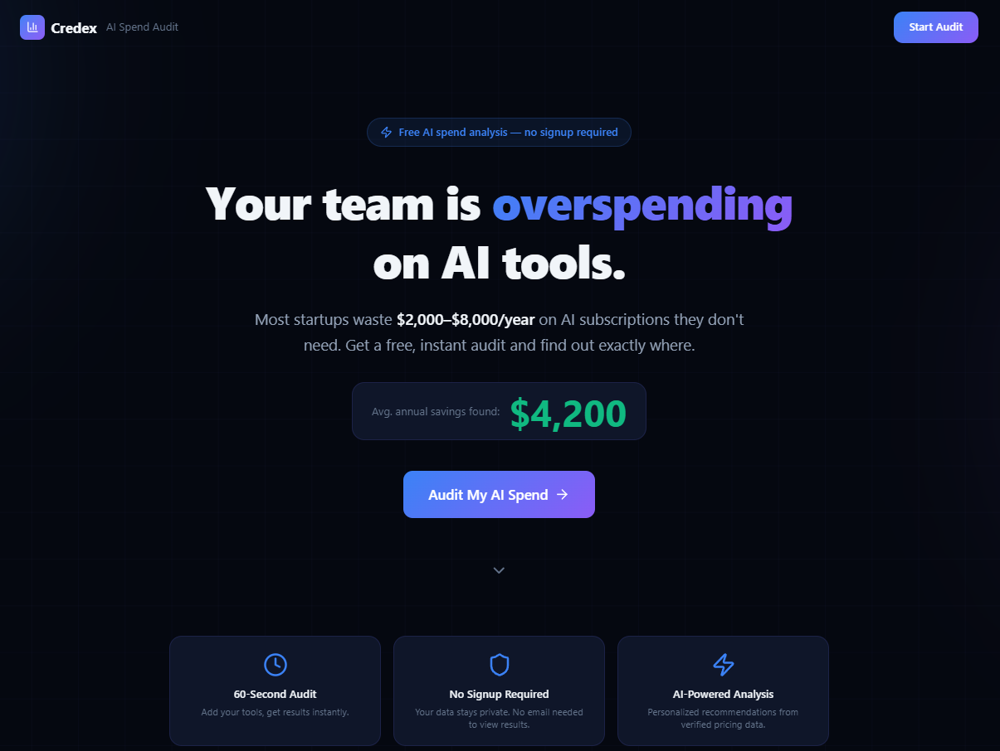
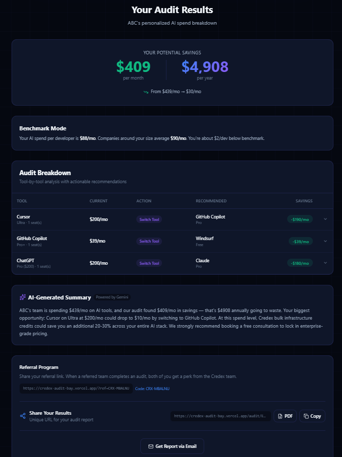
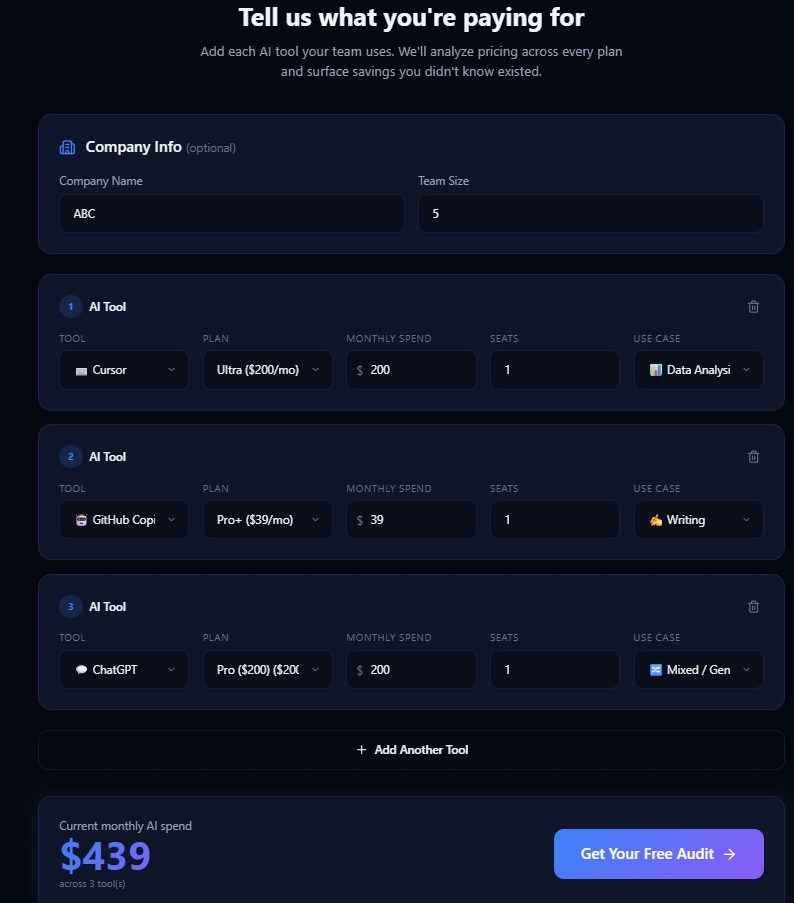
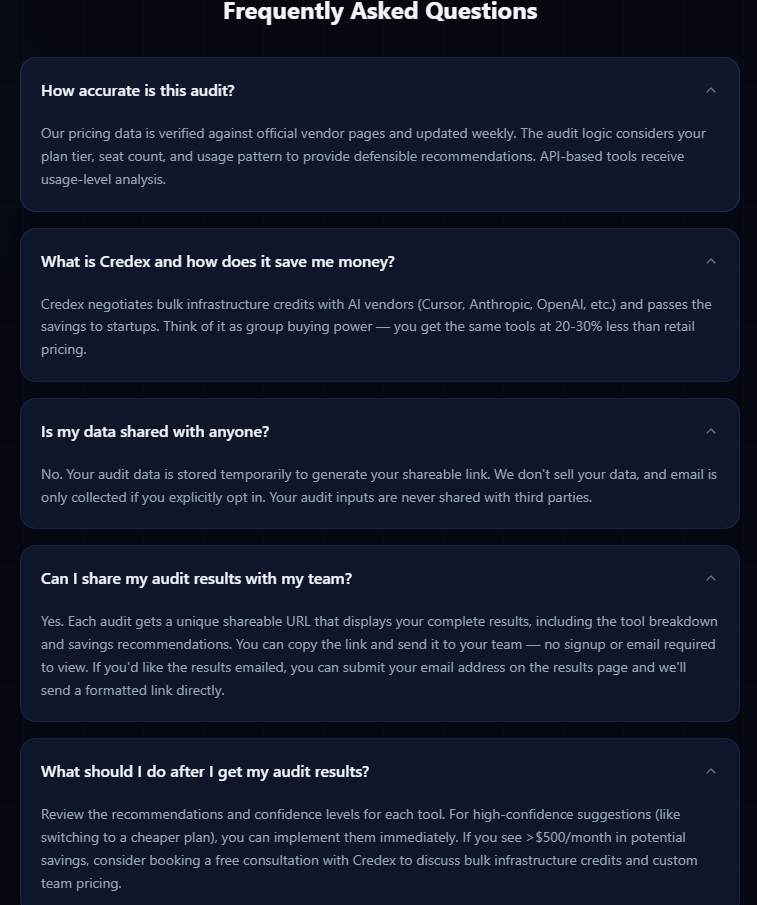

# Credex AI Spend Audit

> **Free AI spend analysis for startups.** Find out exactly where you're overspending on AI tools like Cursor, ChatGPT, Claude, and GitHub Copilot.


**Live Demo:** [https://credex-audit-bay.vercel.app/](https://credex-audit-bay.vercel.app/)

## Screenshots

**Landing Page**



**Audit Results**



**Tools form**



**FAQs**



## What It Does

Startups and teams input their current AI tool subscriptions, and the audit engine analyzes spending across four dimensions:

1. **Plan right-sizing** — Are you on a higher tier than you need?
2. **Same-vendor savings** — Is there a cheaper plan from the same provider?
3. **Cross-tool alternatives** — Could a competing tool do the same job for less?
4. **Credex bulk credits** — Are you paying retail when bulk pricing is available?

Results include a personalized AI-generated summary (via Google Gemini), a shareable URL with OG tags, and optional email capture.

## Quick Start

```bash
# Clone and install
git clone https://github.com/rakshit-pavagadhi/credex-audit.git
cd credex-audit
npm install

# Set up environment variables
cp .env.example .env.local
# Edit .env.local with your API keys

# Run locally
npm run dev

# Run tests
npm test

# Build for production
npm run build
```

## Environment Variables

| Variable | Required | Description |
|----------|----------|-------------|
| `GEMINI_API_KEY` | Optional | Google Gemini API key for AI summaries. Falls back to template. |
| `RESEND_API_KEY` | Optional | Resend API key for transactional emails. |
| `NEXT_PUBLIC_BASE_URL` | Optional | Public URL for email links. Defaults to localhost. |
| `SUPABASE_URL` | Optional* | Supabase project URL. Required for real backend storage. |
| `SUPABASE_SERVICE_ROLE_KEY` | Optional* | Supabase service role key (server-side only). Required for real backend storage. |

`*` If Supabase variables are not set, the app falls back to local JSON storage (`.local-db.json`) for development.

## Decisions: 5 Trade-offs Made

1. **Next.js API Routes vs Server Actions:** Chose API routes for the backend logic (instead of the newer Server Actions) to maintain a clear separation of concerns, making it easier to potentially extract the backend into a separate microservice later, and to ensure reliable integration with Vercel Edge functions for the dynamic OG image generation.
2. **Supabase Client vs Prisma/ORM:** Opted for the direct Supabase JavaScript client rather than a heavier ORM like Prisma. This minimizes dependencies, significantly reduces serverless cold-start times on Vercel, and keeps the data access layer incredibly lean for an MVP that only needs simple `SELECT` and `INSERT` operations.
3. **Google Gemini vs OpenAI/Anthropic:** Selected Google Gemini 2.5 Flash for the AI summary generation primarily because it offers a generous free tier (crucial for a weekend build). Its speed is excellent for real-time user feedback, and it handles the required JSON structuring perfectly without needing the more expensive OpenAI GPT-4o.
4. **Custom Tailwind UI vs Component Library (e.g., shadcn/ui):** Built the UI entirely with raw Tailwind CSS rather than importing a pre-built component library. While this took slightly longer, it ensured the design felt bespoke, premium, and tightly controlled, rather than looking like every other dashboard.
5. **Honeypot + IP Rate Limiting vs reCAPTCHA:** To prevent abuse on the lead capture form, I implemented a hidden honeypot field and in-memory rate limiting instead of a visible CAPTCHA. This trades maximum security for an absolutely frictionless user experience, prioritizing lead conversion for the MVP.

## Tech Stack

- **Framework:** Next.js 16 (App Router)
- **Language:** TypeScript (strict mode)
- **Styling:** Tailwind CSS v4
- **AI Summary:** Google Gemini 2.5 Flash (free tier)
- **Email:** Resend
- **Storage:** Supabase (with local JSON fallback for local dev)
- **Testing:** Vitest (18 tests)
- **CI/CD:** GitHub Actions (lint → typecheck → test → build)
- **Deployment:** Vercel

## Project Structure

```
src/
├── app/
│   ├── page.tsx            # Landing page
│   ├── layout.tsx          # Root layout + SEO
│   ├── globals.css         # Design system
│   ├── audit/[id]/         # Shareable results page
│   └── api/
│       ├── audit/          # POST: run audit
│       ├── lead/           # POST: email capture
│       └── og/             # GET: dynamic OG images
├── components/
│   ├── SpendForm.tsx       # Multi-tool input form
│   └── AuditResults.tsx    # Results display
├── lib/
│   ├── pricing-data.ts     # Verified pricing (May 2026)
│   ├── audit-engine.ts     # Core audit logic
│   ├── ai-summary.ts       # Gemini + fallback
│   └── store.ts            # Supabase + local fallback store
└── types/
    └── index.ts            # TypeScript interfaces
```

## Supabase Setup (Real Backend)

Create two tables in Supabase SQL editor:

```sql
create table if not exists audits (
    id text primary key,
    data jsonb not null,
    created_at timestamptz default now()
);

create table if not exists leads (
    email text primary key,
    audit_id text not null,
    data jsonb not null,
    created_at timestamptz default now()
);
```

Then set `SUPABASE_URL` and `SUPABASE_SERVICE_ROLE_KEY` in your environment.

## Deploy

```bash
# Deploy to Vercel
npx vercel
```

Set environment variables in the Vercel dashboard under Settings → Environment Variables.

## Embeddable Widget

Drop this script tag on any page to embed the audit widget:

```html
<script
    src="https://your-domain.com/api/widget"
    data-base-url="https://your-domain.com"
    data-height="760"
    data-title="AI Spend Audit"
></script>
```

`data-base-url`, `data-height`, and `data-title` are optional overrides.
